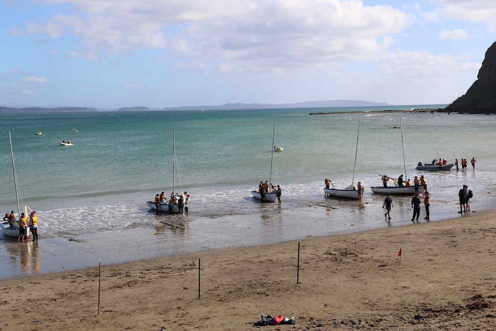

<h2>Navy Cadets</h2>

<section class="image-text top">

The Sea Cadet Corps (SCC), commonly known as Navy Cadets, is the arm of the New Zealand Cadet Forces (NZCF) aligned with the Royal New Zealand Navy (RNZN), which is why we have similar uniforms, rank structure and training. A lot of the training, customs and traditions undertaken by the Navy Cadets aligns with that of the RNZN. 
 
The SCC is one of the three corps in the NZCF, the other two being the New Zealand Cadet Corps (NZCC) and Air Training Corps (ATC), commonly known as the Army Cadets and Air Cadets respectively. We are supported in partnership between the New Zealand Defence Force (NZDF) and local communities, and our members remain civilians with no obligation to join the regular forces, however some do choose to join the New Zealand Defence Force.

</section>

If you decide to become a Navy Cadet, you’ll receive all of the common training that every member of the NZCF receives, but you’ll also receive the Corps Training which is specific to the Navy Cadets! You don't necessarily need to have a strong interest in sailing as Cadet Units offer a wide variety of training and experiences that are unique to the NZCF, and you will learn valuable life and work skills that will open up new possibilities, opportunities and career options. You will be part of a team, develop leadership and survival skills, make new friends, experience challenges and learn to take responsibility.

Navy Cadet Units hold recognised activities throughout the year, including outdoor and adventure training such as:

* Parade Nights - Every unit holds Parade Nights weekly, approximately 3–4 hours per night during the school terms. Each parade night usually begins and ends with a parade. The starting parade follows a traditional RNZN Colours Ceremony to raise the SCC Ensign, to inspect uniforms, and to inform the cadets on the parade night's activities. The final parade follows a traditional RNZN Sunset Ceremony to lower the SCC Ensign, and to inform the cadets on upcoming events in the unit. Between the parades, the cadets undergo classroom or practical instruction.

* Sailing - Teaching our cadets to sail in the Crown and Feva class of boats gives them the opportunity to not only learn the skill of sailing, but also gives them the basis of teamwork and leadership, as they master each position on the boat, leading to a qualification as a Coxswain (Boat Skipper).

* Boatwork and Rigging - Navy Cadets undergo training to develop and maintain safe seamanship skills in power, sail, oar, and paddle craft, and learn the correct way to utilise ropes and pulleys.

* Firearms Safety and Marksmanship Training - Units conduct regular firearms safety training with .22 calibre smallbore target rifles. This training also further develops self-discipline, confidence and teamwork that becomes beneficial during National and International Cadet Shooting Competitions.Cadets must pass a strict TOET (Test of Elementary Training) before being allowed on the range. Cadets can be awarded skills badges in Rifle Proficiency, First Class Shooting and Marksmanship as their shooting skills develop.

* Working with the Navy - Our Navy Cadets are closely aligned to the RNZN and they have the opportunity to experience life in the RNZN, through sea time on operational Navy ships as they transit between ports. 

* Duke of Edinburgh - All training provided by the NZCF can be cross-credited to those who are working towards their Duke of Edinburgh’s Hillary Award, with badges awarded to those who complete the Bronze, Silver or Gold Award. 

<section class="image-text">

On top of all this, cadets are also offered inspiring and challenging military-like experiences, access to serving men and women of the NZDF, and are invited to see behind the scenes of  Air Bases, Army Camps and Navy Ships to see another side of the NZDF. 

</section>

Depending on their Corps, cadets have a number of courses available to them throughout their NZCF careers. These include both leadership (promotion) courses and specific skill training courses. Units also participate in regional and national skills competitions or regattas.

Click here to learn more about the common [Training Offered to every Cadet](training.html), or what [Regional & National Courses](cadetcourses.html) are available as you progress through the NZCF. 